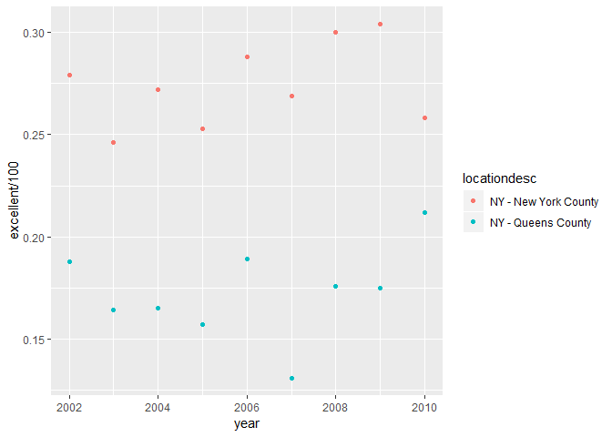

Homework 2
================
Christopher Crowe
September 25, 2018

Problem 1
---------

The piping in the following code chunk:

-   reads in the data
-   cleans the variable names
-   chooses a selection of variables of interest
-   converts the entry variable from character to logical

``` r
subway_data = read_csv("./data/NYC_Transit_Subway_Entrance_And_Exit_Data.csv", col_types = "cccddcccccccccccccccccccccccddcc") %>%
  janitor::clean_names() %>%
  select(line, station_name, station_latitude, station_longitude, route1:route11, entry, vending, entrance_type, ada) %>%
  mutate(entry = recode(entry, "YES" = TRUE, "NO" = FALSE))
```

As a result of the above code chunk, the data frame `subway_data` contains the following variables: `line`, `station_name`, `station_latitude`, `station_longitude`, `route1`, `route2`, `route3`, `route4`, `route5`, `route6`, `route7`, `route8`, `route9`, `route10`, `route11`, `entry`, `vending`, `entrance_type`, and `ada`. The data has been cleaned using the `janitor::clean_names()` function, which transforms all variable names to a format that is more preferable for data science purposes (e.g., `station_name` instead of `Station Name`). At this point, the data frame `subway_data` has the following dimensions: rows = 1868 and columns = 19. While the data have been somewhat cleaned, they are not tidy because we have the route variable spanning multiple columns.

Using this data, the following code can be used to gather the following information:

``` r
subway_data %>% 
  distinct(line, station_name) %>% 
  nrow()
```

-   There are 465 distinct stations.

``` r
subway_data %>%
  select(line, station_name, ada) %>% 
  filter(ada == TRUE) %>% 
  distinct(line, station_name) %>% 
  nrow()
```

-   84 stations are ADA compliant.

``` r
subway_data %>% 
  select(line, station_name, vending, entry) %>% 
  filter(vending == "NO") %>% 
  summarize(round(mean(entry), digits = 2))
```

-   0.38 of all entrances/exits without vending allow entrance.

The following code chunks reformat the data frame into a more tidy format.

``` r
formatted_subway_data = subway_data %>% 
  gather(key = route_number, value = route_name, route1:route11)
```

``` r
formatted_subway_data %>% 
  select(line, station_name, route_name) %>% 
  filter(route_name == "A") %>% 
  distinct(line, station_name) %>% 
  nrow()
```

-   There are 60 distinct stations that serve the A train.

``` r
formatted_subway_data %>% 
  select(line, station_name, route_name, ada) %>% 
  filter(route_name == "A" & ada == TRUE) %>% 
  distinct(line, station_name) %>% 
  nrow()
```

-   Of these stations, 17 are ADA compliant.

Problem 2
---------

The piping in the following code chunk:

-   reads in the Mr. Trash Wheel sheet
-   omits columns with notes
-   cleans the variable names
-   omits rows without dumpster-specific data
-   rounds the number of sports balls to the nearest integer and converts it to an integer variable

``` r
trash_wheel = readxl::read_excel("./data/HealthyHarborWaterWheelTotals2017-9-26.xlsx", "Mr. Trash Wheel", range = cellranger::cell_cols("A:N")) %>% 
  janitor::clean_names() %>% 
  filter(!is.na(dumpster)) %>% 
  mutate(sports_balls = as.integer(round(sports_balls)))
```

The piping in the following code chunk:

-   reads in the 2016 Precipitation and 2017 Precipitation sheets
-   cleans the variable names
-   omits rows without precipitation data
-   adds a variable `year`
-   combines the data from 2016 and 2017
-   converts numeric months to character months

``` r
precipitation_16 = readxl::read_excel("./data/HealthyHarborWaterWheelTotals2017-9-26.xlsx", "2016 Precipitation", range = cellranger::cell_cols("A:B")) %>% 
  janitor::clean_names() %>% 
  filter(!is.na(precipitation_in) & !is.na(x_1) & precipitation_in != "Month") %>% 
  rename(month_var = precipitation_in, total_precip_inches = x_1) %>% 
  mutate(year = "2016", total_precip_inches = round(as.double(total_precip_inches), digits = 2))

precipitation_17 = readxl::read_excel("./data/HealthyHarborWaterWheelTotals2017-9-26.xlsx", "2017 Precipitation", range = cellranger::cell_cols("A:B")) %>% 
  janitor::clean_names() %>% 
  filter(!is.na(precipitation_in) & !is.na(x_1) & precipitation_in != "Month") %>% 
  rename(month_var = precipitation_in, total_precip_inches = x_1) %>% 
  mutate(year = "2017", total_precip_inches = round(as.double(total_precip_inches), digits = 2))


precipitation_16_17 = bind_rows(precipitation_16, precipitation_17) %>%
  select(year, month_var, total_precip_inches) %>% 
  mutate(month_var = month.name[as.integer(month_var)])
```

In the dataset for 2016, there are 12 observations. In the dataset for 2017, there are 8 observations. The key variables in the dataset are `year`, `month_var`, and `total_precip_inches`. `year` represents the year in which the data was recorded, such as 2017. `month_var` represents the month in which the data was recorded, such as January. `total_precip_inches` represents the amount of precipitation (inches) for a given recording period, such as 2.34. Using this data set, we can see that the total precipitation for 2017 so far is 29.93 inches. The median number of sports balls collected in 2016 was 26

Problem 3
---------

The piping in the following code chunk manipulates the BRFSS SMART2010 dataset so that:

-   the variable names are clean
-   we are only focusing on the "Overall Health" topic
-   we have excluded variables for class, topic, question, sample size, and everything from lower confidence limit to GeoLocation
-   the responses (excellent to poor) are variables with the value of `data_value`
-   there is a new variable that shows the proportion of responses that were "Excellent" or "Very Good"

``` r
devtools::install_github("p8105/p8105.datasets")
```

    ## Skipping install of 'p8105.datasets' from a github remote, the SHA1 (21f5ad1c) has not changed since last install.
    ##   Use `force = TRUE` to force installation

``` r
library(p8105.datasets)
data("brfss_smart2010")


brfss_data = brfss_smart2010 %>%
  janitor::clean_names() %>% 
  filter(topic == "Overall Health") %>% 
  select(-class, -topic, -question, -sample_size, -confidence_limit_low:-geo_location) %>% 
  spread(key = response, value = data_value) %>% 
  janitor::clean_names() %>% 
  mutate(proportion_excellent_vgood = (excellent + very_good) / 100)
```

There are 404 distinct locations included in this dataset.There are 51 distinct states represented, so we can assume all 50 states and Washington, DC are represented in this dataset. With 146 observations, NJ is the most observed state. The median of the "Excellent" response value in 2002 was 23.6.

Here is a histogram of the "Excellent" response value in 2002.

    ## `stat_bin()` using `bins = 30`. Pick better value with `binwidth`.


Here is a scatterplot showing the proportion of “Excellent” response values in New York County and Queens County (both in NY State) in each year from 2002 to 2010.


